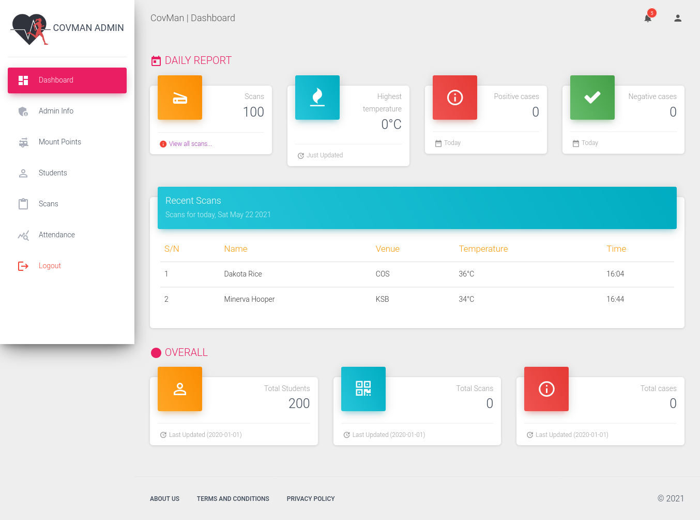
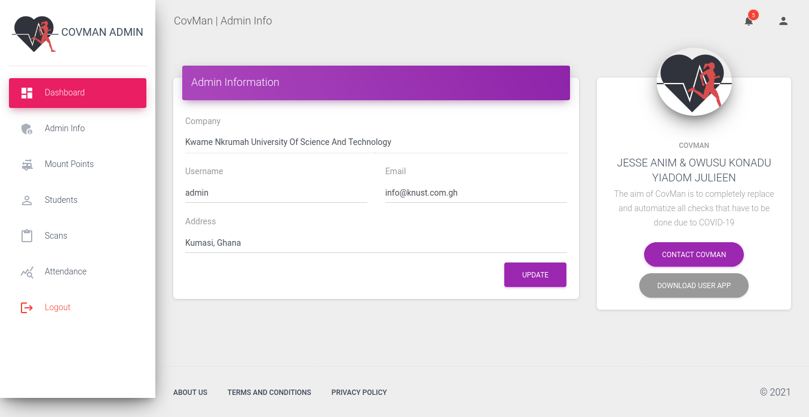
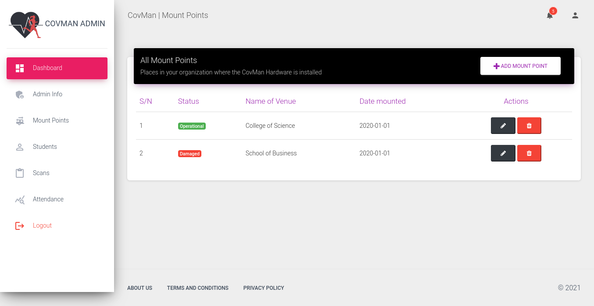

# CovMan Admin :covid:

<!--- Replace <OWNER> with your Github Username and <REPOSITORY> with the name of your repository. -->
<!--- You can find both of these in the url bar when you open your repository in github. -->
<!--  -->

## :scroll: Description

<!--- Describe your app in one or two sentences -->

The aim of COVMAN is to completely replace and automatize all checks that have to be done due to
COVID-19 including;
I. checking for the availability of nose mask on person’s face
II. checking of temperature,
III. provision of sanitizer
IV. marking of attendance in schools and universities
before a person is allowed into a public establishment.

## :bulb: Motivation and Context

Lack of an autonomous system to emphasize the obedience of COVID-19 protocols has brought about
the need for human resources to be used for the monitoring of the said protocols (wearing of nose
mask, using sanitizer, checking temperature and so much more.).

## :camera_flash: Screenshots-->

<!-- You can add more screenshots here if you like -->
&emsp;


## :file_folder: Repo Walkthrough

The repository contains php files used for the project. This is the structure. 

```
------assets
|    |
|    --css
|    |
|    --img
|    |
|    --js
|
------database
|
------includes
|
------partials
|    |
|    --footer
|    |
|    --header
|    |
|    --sidebar
|    |
|    --navbar
|
------screenshots
|
------/

```

## License

```
(The MIT License)

Copyright (c) 2021

Permission is hereby granted, free of charge, to any person obtaining
a copy of this software and associated documentation files (the
'Software'), to deal in the Software without restriction, including
without limitation the rights to use, copy, modify, merge, publish,
distribute, sublicense, and/or sell copies of the Software, and to
permit persons to whom the Software is furnished to do so, subject to
the following conditions:

The above copyright notice and this permission notice shall be
included in all copies or substantial portions of the Software.

THE SOFTWARE IS PROVIDED 'AS IS', WITHOUT WARRANTY OF ANY KIND,
EXPRESS OR IMPLIED, INCLUDING BUT NOT LIMITED TO THE WARRANTIES OF
MERCHANTABILITY, FITNESS FOR A PARTICULAR PURPOSE AND NONINFRINGEMENT.
IN NO EVENT SHALL THE AUTHORS OR COPYRIGHT HOLDERS BE LIABLE FOR ANY
CLAIM, DAMAGES OR OTHER LIABILITY, WHETHER IN AN ACTION OF CONTRACT,
TORT OR OTHERWISE, ARISING FROM, OUT OF OR IN CONNECTION WITH THE
SOFTWARE OR THE USE OR OTHER DEALINGS IN THE SOFTWARE.
```
    
